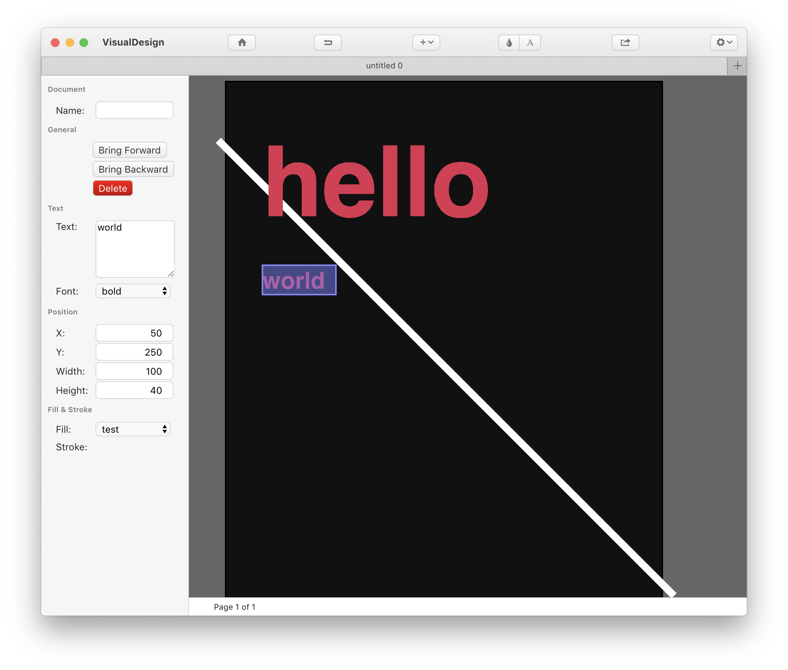

# Table of Contents

1.  [Overview](#org7bf12a1)
2.  [Features](#org17061f2)
3.  [License](#orge8fbf2b)

# Overview

Desktop Publishing Application based on Electron and jsPDF.

This software is work in progress.

# Features

This application consists of three elements; A SVG based editor using a JSON 
based format, a jsPDF based exporter using the format created by the editor
and a UI based on Electron. The first two are developed as independent 
modules and will be published seperately at some point.

# License

This application is licensed under the [BSD Two-Clause Licese](./LICENSE).

